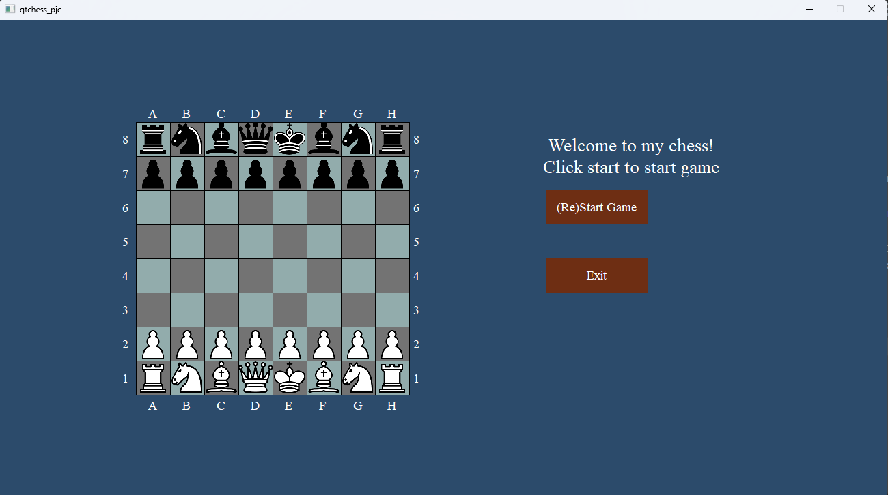
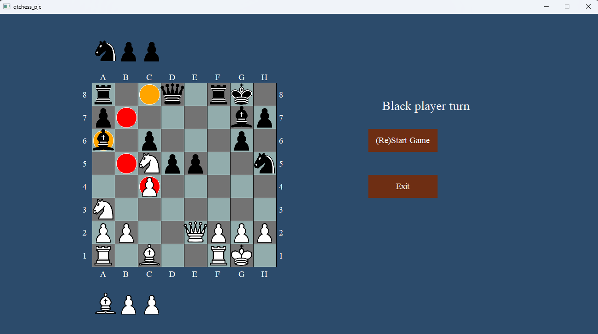
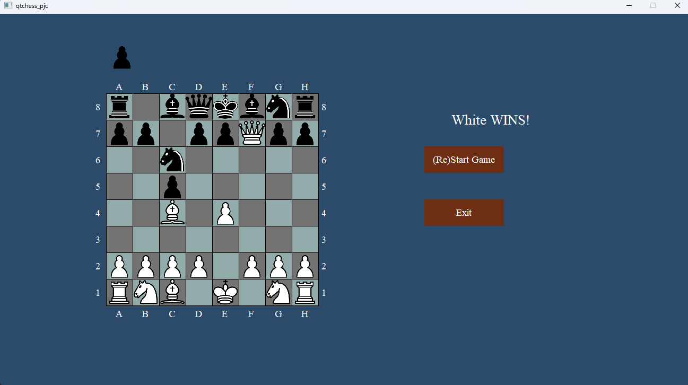

# Chess Project with Qt Framework and Stockfish Engine

This project implements a chess application using C++ and the Qt framework. It includes functionality for playing chess games, analyzing moves, and getting assistance from the Stockfish engine.

## Features

- **Graphical User Interface**: Utilizes Qt framework to provide an intuitive and interactive user interface for playing chess.
- **Chess Engine Integration**: Integrates the Stockfish chess engine to provide move analysis and assistance.
- **Gameplay**: Allows players to play chess games against each other or against the computer.
- **Move Analysis**: Provides move suggestions and analysis based on the Stockfish engine's evaluation.
## Requirements

- C++ Compiler
- Qt Framework

## Images of program
1. Start menu of program

2. Screen from game (yello - stockifsh recommendation)

3. Example end game
